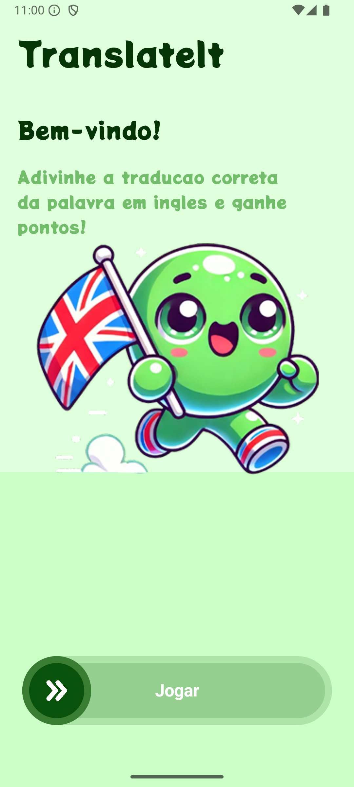
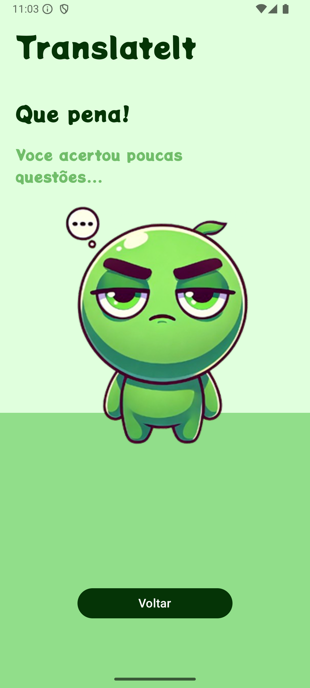

# TranslateIt-Android

**TranslateIt** is an app I developed to make learning English fun and interactive. The app displays a word in English at the center of the screen and four options in Portuguese. The goal is to guess the correct translation to earn points. With well-defined screens and visual feedback (like congratulatory or motivational messages), the app offers a friendly and engaging experience for anyone looking to practice vocabulary.

---

## Screenshots

| Welcome Screen                          | Gameplay Screen                           | Result Screen                           | Result Screen                           |
|-----------------------------------------|-------------------------------------------|-----------------------------------------|-----------------------------------------|
|  |  |  |  |

## Technologies Used

- **Android**: Implemented for handling the core logic and managing game functionality.
- **Android Compose**: Utilized to design the app's user interface with a declarative approach.
- **MVVM Architecture**: Ensures a clear separation between the UI (View) and business logic (ViewModel).
- **Android Studio**: The primary IDE used for development and testing the application.

---
